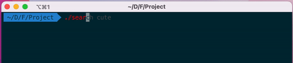

## Execution

Start executing the Videos Search Project by typing `./search KEYWORD` in Terminal.

 

## Installation
- `youtube-dl`
http://ytdl-org.github.io/youtube-dl/

- `instaloader`
https://instaloader.github.io/

- `tiktok_downloader`
https://elements.heroku.com/buttons/krypton-byte/tiktok-downloader

- `magick`
https://imagemagick.org/


##### python modules & libraries

- `os`
https://docs.python.org/3/library/os.html

- `sys`
https://docs.python.org/3/library/sys.html

- `NumPy`
https://numpy.org/

- `re`
https://docs.python.org/3/library/re.html

- `urljoin`
https://docs.python.org/3/library/urllib.parse.html

- `glob`
https://docs.python.org/3/library/glob.html

- `subprocess`
https://docs.python.org/3/library/subprocess.html

- `BeautifulSoup`
https://www.crummy.com/software/BeautifulSoup/

- `scenedetect`
https://scenedetect.com/

## Execution Route
Executable `search` &rarr; `script.sh` &rarr; `Download.py` &rarr; `script.js` &rarr; `scenedetect` &rarr; `magick` &rarr; `index.html`

## Project Structure

```
./Final_Project
├── ./Code
│   ├── ./htmlUI_IG
│   ├── ./htmlUI_TikTok
│   ├── ./htmlUI_YT
│   ├── search.c
│   ├── customize.css
│   ├── index.html
│   ├── run.sh
│   └── search
│
├── ./Doc
│   └── execution.gif
│
├── Final Project Description FALL22.pdf
└── README.md
```

The workspace is structured in following:

- `/Code` : a folder to maintain source codes.
    - `htmlUI_IG` : A folder to maintain the code that scraping the Instagram web page and contains python scripts to automate to downloading process.
        - `index.html` : In this `.html` file, it is the main UI for Instagram page, and it creates a structure to match the scraping results. It is one of the buttons on top of navigation bar, allowing user to switch the image generating view pages between IG, TikTok, and YT. The red buttons provides links to let the user go back to the original video pages.
        - `Download.py` : A python script to get data from beatifulsoup scraping and download videos by using `instaloader` and its arguments. At the same time, it runs another fork process to delete other format of data and keep `rm -r` until there are 10 videos in the folder. Once the it done, it will `open` `script.js` and hard write the first line file and input the javascript object data in it. After it get all video links, it starts downloading videos via `scenedetect` and creating `.jif` by `magick`, running on multiple threads of `subprocess` to fully utilize CPU and memory.
        - `script.js` : The functions in this file will be trigger from the red buttons of the `index.html` file and redirect the user to the video web page. The first line of the file is gotten from python script and will be edited and hard-written every time the python script runs.

    - `htmlUI_TikTok` :  A folder to maintain the code that scraping the TikTok web page and contains python scripts to automate to downloading process.
        - `index.html` : In this `.html` file, it is the main UI for TikTok page, and it creates a structure to match the scraping results. It is one of the buttons on top of navigation bar, allowing user to switch the image generating view pages between IG, TikTok, and YT. The red buttons provides links to let the user go back to the original video pages.
        - `Download.py` : A python script to get data from `Beatifulsoup` scraping and download videos by using `tiktok_downloader` and its arguments. Once the it done, it will `open` `script.js` and hard write the first line file and input the javascript object data in it. At the same time, it distributs 10 videos from gotten links into 10 folders. After it get all video links, it starts downloading videos via `scenedetect` and creating `.jif` by `magick`, running on multiple threads of `subprocess` to fully utilize CPU and memory.
        - `script.js` : The functions in this file will be trigger from the red buttons of the `index.html` file and redirect the user to the video web page. The first line of the file is gotten from python script and will be edited and hard-written every time the python script runs.

    - `htmlUI_YT` :  A folder to maintain the code that scraping the YouTube web page and contains python scripts to automate to downloading process.
        - `index.html` : In this `.html` file, it is the main UI for YouTube page, and it creates a structure to match the scraping results. It is one of the buttons on top of navigation bar, allowing user to switch the image generating view pages between IG, TikTok, and YT. The red buttons provides links to let the user go back to the original video pages.
        - `Download.py` : A python script to get data from `Beatifulsoup` scraping and download videos by using `youtube-dl` and its arguments. Once the it done, it will `open` `script.js` and hard write the first line file and input the javascript object data in it. At the same time, it distributs 10 videos from gotten links into 10 folders. After it get all video links, it starts downloading videos via `scenedetect` and creating `.jif` by `magick`, running on multiple threads of `subprocess` to fully utilize CPU and memory.
        - `script.js` : The functions in this file will be trigger from the red buttons of the `index.html` file and redirect the user to the video web page. The first line of the file is gotten from python script and will be edited and hard-written every time the python script runs.

    - `search.c`  : In this `.c` file, it will generate an output executable file `search` by command line `gcc -o search search.c`. This is a way of hiding and wrapping up all commands for user, and the user does not need to type several arguments. The `.c` file called system call `execvp` and passed a list of default arguments to run the script `run.sh` in the same current directory.
    - `customize.css`  : Cascading Style Sheets is a style sheet language used for describing the presentation of a document written in a markup language such as HTML or XML, in this case, it defines the `index.html` for each current directory.
    - `index.html`  : In the first main page, it will be triggered by executable file `search` created from C language.
    - `search`  : An executable the was compiled by `search.c` file. It is used to encapsulate command line arguements.