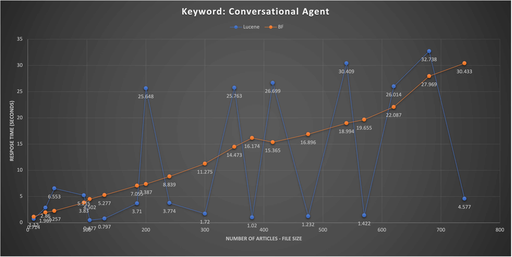

## Research

In this assignment, we are seeking for the performance of utilizing Apache Lucene, a open-source search engine software library, to check it makes trade off bwtween space and time. In this case, we make a linear search on a certain string in multiple different size of xml files to check the time both lucene and linear search consume.

## Project Structure

```
./HW3
├── /Code
│   ├── LuceneMain.java
│   ├── BFMain.java
│   │
│   └── /data
│       │
│       └── data.xlsx
│
├── Homework_3.pdf
├── graph.png
├── examplecode.txt
├── lucene-core-8.2.0.jar
├── lucene-queryparser-8.2.0.jar
└── README.md

```

The workspace is structured in follwing:

- `/Code` : a folder to maintain source codes.
    - `LuceneMain.java` : In this file, it will create index cache mapping to each line of strings. At the next time, when a token is searched, it will be significantly save time because of tracing the string index from space.
    
    - `BFMain.java` : It searches token each line by line and makes a linear search. 


## Graph


In this graph, we can see that when the number of the articles getting larger, the lucene searching method reduce time significantly comparing to linear search.
