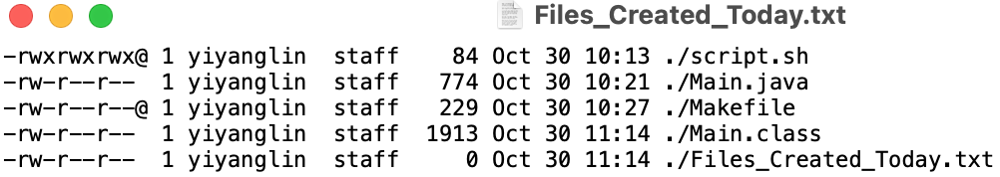

## Execution

Start executing java codes in `Makefile` with its following targets - `today` and `clean` in `/Code` repository.

## Project Structure

```
./HW4
├── /Code
│   ├── Main.java
│   ├── Makefile
│   ├── script.sh
│   └── Files_Created_Today.txt
│
├── Homework_4.pdf
└── README.md
```

The workspace is structured in following:

- `/Code` : a folder to maintain source codes.
    - `Makefile` : A file to automate `today` and `clean` functions.
    - `Main.java` : In this file, it catches inputs from `args` to gain  arguements from command-line, the first argument is the `script.sh` file, which is a shell script file that the ProcessBuilder will trigger.
    - `script.sh` : A shell script file that lists down the files created in the current directory.
    - `Files_Created_Today.txt` : The listed files will be redirected from the screen into this file by `>`.
        ```
        find . -mtime -1 -type f -print | xargs ls -ltr > Files_Created_Today.txt
        ```
        - `find` used to search files.
        - `.` means the current directory that intended to be searched.
        - `-mtime` is the file modification time.
        - `-1` means displaying files created in last 24 hrs.
        - `-type f` represents file type.
        - `-print` prints the pathname of the current file to standard output.
        - `|` is a pipe operator that combines arguments.
        - `-l` following by file mode, number of links, owner name, group name, number of bytes in the file, abbreviated month, day-of-month file was last modified, hour file last modified, minute file last modified, and the pathname.
        - `-t` sorts the names of files with the same modification timestamp in the same sense as the time sort.
        - `-r` reverses the order of the sort. 
        - `>` redirects the output of a command in another file.
        - `Files_Created_Today.txt` the target file of the output to be saved.
        

  
Meanwhile, the compiled output files will be generated in the `.class` extension by default.

## Screenshot



## Clean up

After execution, type `make clean` to clean up `.class` and `Files_Created_Today.txt` files.
